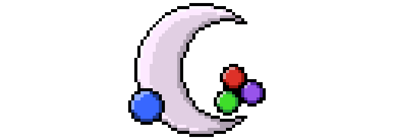

# jluna: A modern julia ⭤ C++ Wrapper (v0.7.0)



Julia is a beautiful language, it is well-designed and well-documented. Julias C-API is also well-designed, less beautiful and much less... documented.

Heavily inspired in design and syntax by (but in no way affiliated with) the excellent Lua⭤C++ wrapper [**sol2**](https://github.com/ThePhD/sol2), `jluna` aims to fully wrap the official julia C-API, replacing it in usage in C++ projects by making accessing julias unique strengths through C++ safe, hassle-free, and just as beautiful.

---

### Table of Contents

0. [Introduction](README.md)
1. [Showcase](#showcase)<br>
2. [Features](#features)<br>
3. [Planned Features](#planned-but-not-yet-implemented)<br>
4. [Documentation](#documentation)<br>
    4.1 [🔗 Manual](./docs/manual.md)<br>
    4.2 [🔗 Installation](./docs/installation.md)<br>
    4.3 [🔗 Troubleshooting](./docs/installation.md#troubleshooting)<br>
5. [Dependencies](#dependencies)<br>
   5.1 [julia 1.7.0+](#dependencies)<br>
   5.2 [Supported Compilers: g++11, clang12](#dependencies)<br>
   5.3 [cmake 3.19+](#dependencies)<br>
   5.4 [Linux / Mac OS](#dependencies)
6. [License](#license)
   
---

### Showcase
#### Access Julia-Side Values/Functions
```cpp
// execute arbitrary strings with exception forwarding
State::safe_script(R"(
    f(x) = x*x*x
    
    mutable struct MyStruct
        _field
        MyStruct() = new(123)
    end

    instance = MyStruct();
)");

// access and modify variables
Main["instance"]["_field"] = 456;
State::script(R"(println("instance._field is now: ", instance._field))");

// call julia-side functions with C++-side values
int result = Main["f"](12);
Base["println"](result);
```
```
instance._field is now: 456
1728
```
---
#### Multi-Dimensional Array Interface
```cpp
State::script("array = collect(1:9)");
Array<size_t, 1> cpp_array = Main["array"];

// iterable and assignable
for (auto e : cpp_array)
    e = e.operator size_t() + 10;

State::script("println(array)");

// julia style list indexing
auto sub_array = cpp_array[{6, 5, 4, 3, 2}];
Base["println"]((Any*) sub_array);

// even supports comprehension
auto comprehended_vec = Vector<Int64>("(i for i in 1:10 if i % 2 == 0)"_gen);
    Base["println"](comprehended_vec);
```
```
[11, 12, 13, 14, 15, 16, 17, 18, 19]
[17, 16, 15, 14, 13]
[2, 4, 6, 8, 10]
```
---
#### Call C++ Functions from julia

```cpp
/// register lambda and bind to julia-side variable
State::new_named_undef("lambda") = [](Any* x, Any* y) -> Any*
{
    auto as_string = unbox<std::string>(x);
    std::cout << "cpp prints " << as_string << " and returns: " << std::endl;
    auto as_set = unbox<std::set<size_t>>(y);

    size_t out = 0;
    for (size_t x : as_set)
        out += x;

    return box(out);
};

// now callable from julia
State::safe_script(R"(
    println(Main.lambda("what julia handed it", Set([1, 2, 3, 3, 4])))  # non-c-types work!
)");
```
```
cpp prints what julia handed it and returns: 
10
```
---

### Features
Some of the many advantages `jluna` has over the C-API include:

+ expressive generic syntax
+ call C++ functions from julia using any julia-type
+ assigning C++-side proxies also mutates the corresponding variable with the same name julia-side
+ julia-side values, including temporaries, are kept safe from the garbage collector
+ verbose exception forwarding, compile-time assertions
+ wraps [most](./docs/quick_and_dirty.md#list-of-unboxables) of the relevant C++ `std` objects and types
+ multidimensional, iterable array interface with julia-style indexing
+ deep, C++-side introspection functionalities for julia objects
+ fast! All code is considered performance-critical and was optimized for minimal overhead compared to the C-API
+ manual written by a human
+ inline documentation for IDEs for both C++ and Julia code 
+ freely mix `jluna` and the C-API
+ And more!

### Planned (but not yet implemented):

(in order of priority, highest first)

+ windows / MSVC support
+ thread-safety, parallelization
+ usertypes, creating modules and struct completely C++-side
+ linear algebra wrapper, matrices
+ expression proxies
+ multiple julia worlds, save-states: restoring a previous julia state
---

## Documentation

A step-by-step introduction and reference guide is available [here](./docs/manual.md). Furthermore, all user-facing code has in-line documentation available through most IDEs (or the julia `help?` command). 

Advanced users are encouraged to check the headers (available in `jluna/include/`) for implementation details. They are formatted specifically to be easily understood by 3rd parties. 

---

## Dependencies

`jluna` aims to be as modern as is practical. It uses C++20 features extensively and aims to support the newest julia version, rather than focusing on backwards compatibility. If you are looking for a C++ library that supports julia 1.5 or lower, consider checking out [CxxWrap](https://github.com/JuliaInterop/CxxWrap.jl) instead.

For `jluna` you'll need:
+ [**Julia 1.7.0**](https://julialang.org/downloads/#current_stable_release) (or higher)
+ [**cmake 3.16**](https://cmake.org/download/) (or higher)
+  C++ Compiler (see below)
+ unix-based, 64-bit operating system

Currently [**g++10**](https://askubuntu.com/questions/1192955/how-to-install-g-10-on-ubuntu-18-04), [**g++11**](https://lindevs.com/install-g-on-ubuntu/) and [**clang-12**](https://linux-packages.com/ubuntu-focal-fossa/package/clang-12) are supported. g++-11 is the primary compiler used for development of `jluna` and is thus recommended.

Windows and MSVC support is planned in the near future.


---

## [Installation & Troubleshooting](./docs/installation.md)

A step-by-step tutorial on how to create, compile and link a new C++ Project with `jluna` can be found [here](./docs/installation.md). It is recommended that you follow this guide closely, instead of trying to resolve issues on your own.

### For Advanced Users Only

Users familiar with C++ and cmake can go through the following steps:

Install:

+ `g++-11` (or `clang-12`)
+ `julia 1.7+`
+ `cmake 3.16+`

Then execute (in the same directory as your `CMakeLists.txt`):

```bash
git clone https://github.com/Clemapfel/jluna.git

export JULIA_PATH=$(julia -e "println(joinpath(Sys.BINDIR, \"..\"))")

mkdir build
cd build
cmake -D CMAKE_CXX_COMPILER=g++-11 .. # or clang-12
make

./JLUNA_TEST

cd ..
rm -r build
```

Where `JULIA_PATH` needs to be set at the time of compilation.

Link against `jluna/libjluna.so`, `jluna/libjluna_c_adapter.so` and `$ENV{JULIA_PATH}/lib/libjulia.so`.

Add `"${CMAKE_SOURCE_DIR}/jluna"` and `"$ENV{JULIA_PATH}/include/julia"` to your include directories.

Then you can make `jluna` available to your library using:

```cpp
#include <julia.h>
#include <jluna.hpp>
```

If errors appear at any point, head to the [step-by-step guide](./docs/installation.md).

---

## License

`jluna` is supplied under Open Software License 3.0, available [here](https://opensource.org/licenses/OSL-3.0).
For collaboration or further questions, feel free to [contact the developer](https://www.clemens-cords.com/contact).

---
